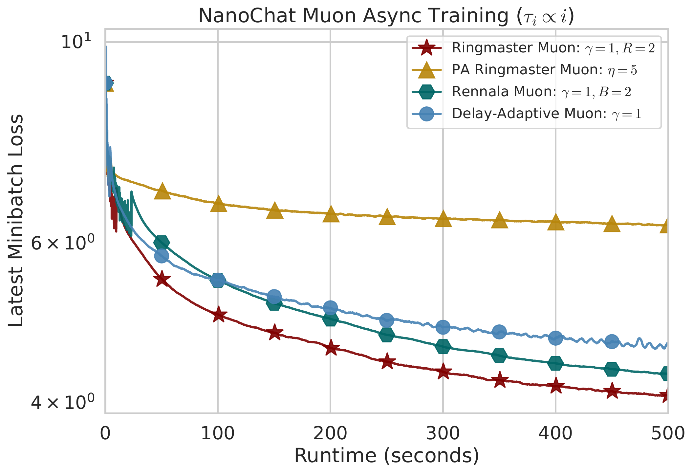

# Ringmaster LMO

Code for comparing the Ringmaster LMO asynchronous momentum method against other asynchronous Muon baselines on a small NanoChat language-model objective.

The experiment models heterogeneous worker delays, measures progress by wall-clock runtime, and tracks the latest minibatch loss during training. The main comparison below shows Ringmaster Muon reaching lower loss faster than the other tested asynchronous Muon variants under increasing worker delays.



## Paper

The accompanying paper is available on arXiv:

**Ringmaster LMO: Asynchronous Linear Minimization Oracle Momentum Method**  
[arXiv:2605.18174](https://arxiv.org/abs/2605.18174)

## What Is Included

- `ringmaster.py`: main experiment runner for tuning and comparing asynchronous Muon methods.
- `measure_nanochat_gradient_time.py`: measures stochastic-gradient wall-clock time on the current GPU.
- `plot_nanochat_traces.py`: replots saved JSON traces from a completed comparison run.
- `src/nanochat_async.py`: NanoChat language-model objective, tokenizer/data preparation, and flat-parameter interface.
- `src/asynchronous/`: asynchronous transport and optimizer implementations.
- `src/factory.py`, `src/signature.py`: small helpers used by the async optimizer code.

## Methods Compared

The main experiment compares:

- Ringmaster Muon
- Parameter-Agnostic Ringmaster Muon
- Rennala Muon
- Delay-Adaptive Muon

Muon updates are applied blockwise to matrix-shaped model parameters and fall back to momentum-style updates for parameters where Muon is not appropriate.

## Setup

Python 3.11+ is recommended. A CUDA-capable GPU is strongly recommended for the NanoChat runs.

```bash
python3 -m venv .venv
source .venv/bin/activate
pip install -r requirements.txt
```

By default, NanoChat assets are cached outside the repository:

```bash
~/.cache/autoresearch
```

Override this location with:

```bash
export AUTORESEARCH_CACHE_DIR=/path/to/cache
```

The first run downloads parquet shards from the Karpathy `climbmix-400b-shuffle` dataset and trains/loads the tokenizer cache.

## Typical Workflow

Measure gradient timing on the current GPU:

```bash
python measure_nanochat_gradient_time.py --compile-model
```

Run a comparison using the hard-coded default parameters:

```bash
python ringmaster.py --mode compare_defaults
```

Tune hyperparameters and then run the final comparison:

```bash
python ringmaster.py \
  --mode tune_and_compare \
  --time-lim 500 \
  --tuning-time-lim 500 \
  --num-trials 1 \
  --params-file ringmaster_nanochat_muon_tuned_params.json
```

Replot a saved trace:

```bash
python plot_nanochat_traces.py \
  --trace-file ringmaster_nanochat_traces.json \
  --output ringmaster_nanochat_replot.pdf
```

## Outputs

The experiment runner writes:

- comparison plots, such as `ringmaster_nanochat_500.pdf`
- trace JSON files, such as `ringmaster_nanochat_traces.json`
- tuned-parameter JSON files when running in tuning mode
- optional per-method tuning plots when `--plot-tuning-lines` is enabled

Generated plots, traces, and tuning outputs are ignored by Git by default. The README figure `ringmaster_plot.png` is kept in the repository as the representative result.

## Repository Layout

```text
.
|-- README.md
|-- requirements.txt
|-- ringmaster.py
|-- measure_nanochat_gradient_time.py
|-- plot_nanochat_traces.py
|-- ringmaster_plot.png
`-- src
    |-- nanochat_async.py
    |-- factory.py
    |-- signature.py
    `-- asynchronous
        |-- algorithm.py
        `-- asynchronous_transport.py
```

## Citation

If you use this code, please cite the accompanying paper.

```bibtex
@article{ringmaster_lmo,
  title         = {Ringmaster LMO: Asynchronous Linear Minimization Oracle Momentum Method},
  author        = {Sadiev, Abdurakhmon and Maranjyan, Artavazd and Ilin, Ivan and Richtarik, Peter},
  journal       = {arXiv preprint arXiv:2605.18174},
  year          = {2026},
  doi           = {10.48550/arXiv.2605.18174},
  url           = {https://arxiv.org/abs/2605.18174}
}
```
